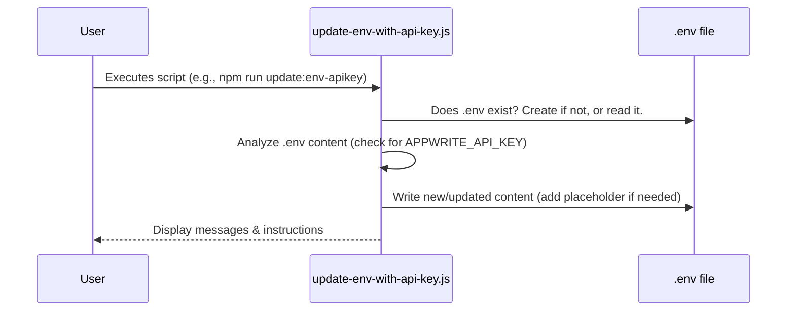

# Chapter 1: Environment Configuration Automation

Welcome to the `comet-scanner-template-wizard` tutorial! This project includes several powerful automation features to make your development and deployment process smoother. In this first chapter, we'll dive into a fundamental concept: **Environment Configuration Automation**.

## What's the Big Deal with Configuration?

Imagine you're building an application, like our COMET Scanner. This app needs to talk to other services on the internet – perhaps a backend like Appwrite to store user data, or Supabase for extra storage. To connect to these services, your app needs specific "addresses" (like URLs) and "secret keys" (like API keys).

Think of it like sending a letter:
*   You need the recipient's **address** (the service URL).
*   Sometimes, you need a special **key** to open their mailbox (an API key).

Where do you store these addresses and keys? You could write them directly into your app's code, but that causes a few problems:
1.  **Security Risk:** If your API keys are in your code, anyone who sees your code (like on GitHub) can also see your secret keys! This is like leaving your house keys under the doormat.
2.  **Inflexibility:** What if you have different addresses for testing on your computer versus when the app is live for users? Changing them directly in the code for each scenario is messy and error-prone.

This is where **Environment Configuration Automation** comes to the rescue!

## Meet Your Application's "Meticulous Secretary"

Environment Configuration Automation is like having a very organized and careful secretary for your application. This "secretary" (which is actually a set of smart scripts) manages all your application's settings and secrets.

Its main job is to:
*   Prepare and update special configuration files (primarily a file named `.env`).
*   Ensure your application always has the correct "keys" and "addresses" to connect to services like Appwrite, Supabase, or deployment platforms like Netlify.
*   Keep sensitive information (like API keys) secure and separate from your main codebase.

The most common way to store these settings is in a file called `.env`. This file typically lives in the root directory of your project.

**What's a `.env` file?**
It's a simple text file where you define settings as `KEY=VALUE` pairs, like this:

```
# This is a comment explaining the setting
VITE_APPWRITE_ENDPOINT=https://cloud.appwrite.io/v1
VITE_APPWRITE_PROJECT_ID=your-actual-project-id
# Another important secret
APPWRITE_API_KEY=your-super-secret-api-key
```

*   Lines starting with `#` are comments.
*   `VITE_APPWRITE_ENDPOINT` is a key, and `https://cloud.appwrite.io/v1` is its value.
*   This file is usually *not* committed to your Git repository (thanks to a `.gitignore` file), so your secrets stay safe!

Your application can then read these values when it starts up.

## Why Automate This?

Our "secretary" scripts help in several ways:
*   **Consistency:** They ensure the `.env` file has the necessary placeholders and structure.
*   **Guidance:** They can provide instructions on where to find certain values (like API keys).
*   **Reduced Errors:** Manually editing config files can lead to typos. Scripts can help set things up correctly.

Let's look at an example from our project.

## Example: Getting Ready for an Appwrite API Key

Suppose you've set up an Appwrite project but haven't told your application how to use a specific Appwrite API key for server-side operations. The `update-env-with-api-key.js` script helps with this.

This script doesn't ask you for the API key directly. Instead, it "prepares" your `.env` file by:
1.  Checking if you already have an API key configured.
2.  If not, it adds helpful comments and a placeholder for `APPWRITE_API_KEY`.
3.  It then tells you *how* to get an API key from Appwrite and where to put it in the `.env` file.

**How to run a script like this (conceptual):**
You'd typically run it from your project's command line:
```bash
node update-env-with-api-key.js
```
*(Note: In this project, scripts are often run via `npm run <script-name>` which is configured in `package.json`)*

**What happens?**
*   **Input:** The script reads your existing `.env` file (if any).
*   **Processing:** It checks for the `APPWRITE_API_KEY` setting.
*   **Output:**
    *   Your `.env` file might be updated with new lines.
    *   You'll see messages in your terminal guiding you.

For example, if your `.env` file was empty for `APPWRITE_API_KEY`, the script might add something like this:

```env
# (other settings might be here already)

# MCP Server Configuration (not exposed to the client)
# ... other server settings ...
# You need to add your Appwrite API key below
# APPWRITE_API_KEY=your-api-key-here
```

And in your terminal, you'd see instructions like:
```
🔄 Updating .env file with API key instructions
---------------------------------------------
✅ Updated .env file with API key instructions at /path/to/your/project/.env

To get an Appwrite API key:
1. Log in to your Appwrite Console: https://cloud.appwrite.io/console
2. Select your project
3. Go to "API Keys" in the left sidebar
... (and so on)
```

## Under the Hood: A Peek at `update-env-with-api-key.js`

Let's simplify how such a script works internally.

**The Process (Non-Code Steps):**

1.  The script starts.
2.  It looks for the `.env` file in your project.
3.  It reads the content of the `.env` file.
4.  It checks if a line for `APPWRITE_API_KEY` (that isn't a placeholder) already exists.
5.  If an actual API key is already there, it might say "✅ API key already exists".
6.  If only a placeholder like `APPWRITE_API_KEY=your-api-key-here` exists, it reminds you to replace it.
7.  If no `APPWRITE_API_KEY` line (or related section) exists, it carefully adds a new section with comments and the placeholder `APPWRITE_API_KEY=your-api-key-here`.
8.  It saves these changes back to the `.env` file.
9.  Finally, it prints helpful messages and instructions to your terminal.

**Visualizing the Interaction:**



**Simplified Code Glimpse:**

Let's look at a tiny, simplified piece of what the script does. Remember, the actual script has more checks and features!

*Finding and reading the `.env` file:*
```javascript
// From: update-env-with-api-key.js (simplified)
import fs from 'fs'; // Node.js module for file system operations
import path from 'path'; // Node.js module for working with file paths

// Path to .env file (assuming script is in root or navigates correctly)
const envPath = path.join(process.cwd(), '.env');
let envContent = '';

if (fs.existsSync(envPath)) {
  envContent = fs.readFileSync(envPath, 'utf8'); // Read the file
  console.log('Found existing .env file.');
} else {
  console.log('.env file not found. One might be created or instructions given.');
}
```
This snippet first sets up the path to your `.env` file. Then, it checks if the file exists. If it does, it reads its content into the `envContent` variable.

*Adding instructions and writing back (simplified):*
```javascript
// From: update-env-with-api-key.js (continued, very simplified)

const apiKeyInstructionsSection = `
# MCP Server Configuration (not exposed to the client)
# ... (other related settings might be copied or set here)
# You need to add your Appwrite API key below
# APPWRITE_API_KEY=your-api-key-here
`;

// Check if our specific instructions are already there
if (!envContent.includes('# MCP Server Configuration')) {
  envContent += apiKeyInstructionsSection; // Add the new section
  fs.writeFileSync(envPath, envContent); // Save changes to the file
  console.log('Added API key instructions to .env file.');
}
```
Here, the script prepares the text for the API key instructions. If this specific section isn't found in the current `.env` content, it appends the new section and then writes the entire modified content back to the `.env` file.

Many other scripts in this project, like `scripts/setup-appwrite-sdk.js` or `scripts/get-supabase-credentials.js`, also interact with the `.env` file. Some might prompt you for values and write them directly, while others (like `setup-appwrite-sdk.js`) might first create resources in a cloud service and then save the new IDs of those resources into your `.env` file. We'll explore these more in chapters like [Appwrite Resource Provisioning](02_appwrite_resource_provisioning_.md) and [Supabase Resource Provisioning](03_supabase_resource_provisioning_.md).

## Key Takeaways
*   **Configuration is Key:** Applications need settings like API keys and URLs.
*   **`.env` Files:** A common, secure way to store these settings, kept out of version control.
*   **Automation Scripts:** Act like a "secretary" to help manage `.env` files, ensuring consistency, providing guidance, and reducing errors.
*   **Security and Flexibility:** This approach keeps secrets safe and makes it easy to use different configurations for different environments (like development vs. production).

## Conclusion

You've now learned about Environment Configuration Automation and how it helps manage your application's vital settings securely and efficiently using `.env` files and helper scripts. This "meticulous secretary" ensures your app knows how to connect to the services it needs.

Now that we understand how our application gets its settings, let's see how we can automatically set up the backend services themselves. In the next chapter, we'll explore [Appwrite Resource Provisioning](02_appwrite_resource_provisioning_.md).

---

Generated by [AI Codebase Knowledge Builder](https://github.com/The-Pocket/Tutorial-Codebase-Knowledge)