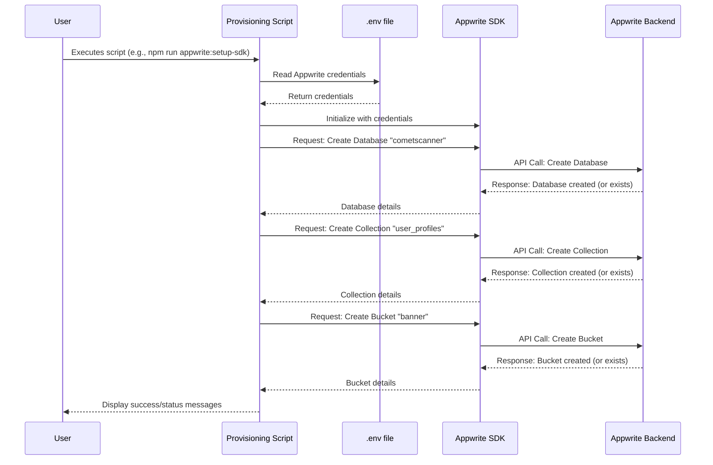

# Chapter 2: Appwrite Resource Provisioning

Welcome to Chapter 2! In [Chapter 1: Environment Configuration Automation](01_environment_configuration_automation_.md), we learned how our application gets its important settings, like API keys and server addresses, managed by our "meticulous secretary" – the `.env` file and helper scripts. Now that our app knows *how* to talk to services, let's explore how we can automatically set up one of those key services: our Appwrite backend.

## What is Appwrite Resource Provisioning? Your Digital Office Builder!

Imagine you're setting up a new physical office for your COMET Scanner project. You wouldn't just move into an empty room, right? You'd need:
*   **Filing Cabinets:** To store important documents (this is like an Appwrite **Database**).
*   **Folders within Cabinets:** To organize different types of documents, like "User Profiles," "Website Content," "Image Records," and "Activity Logs" (these are like Appwrite **Collections**).
*   **Secure Storage Rooms:** For valuable items like different types of images – maybe one for website banners, another for user gallery photos, and a special one for images from the scanner itself (these are like Appwrite **Storage Buckets**).

Manually setting up this "digital office" in Appwrite for every new developer or every new deployment would be time-consuming and error-prone. What if you forget a folder or mislabel a cabinet?

**Appwrite Resource Provisioning** is like having an automated construction crew that builds and organizes this primary digital office for you. It's a set of scripts that use Appwrite's tools (like its Software Development Kit - SDK) to:
1.  Create the main database.
2.  Set up all the necessary collections (folders) with their specific fields (attributes).
3.  Prepare the storage buckets (secure rooms) for different types of files.

This ensures that all the backend structures your COMET Scanner application needs to store data, manage users, and handle files are perfectly in place, automatically!

## How Does This "Automated Crew" Work?

Our project includes scripts (like `scripts/setup-appwrite-sdk.js` or `setup-appwrite-resources-limited.js`) designed to communicate with your Appwrite instance. Here's the general idea:

1.  **Get the Blueprints & Keys:** The script first looks at your `.env` file (which we discussed in [Chapter 1: Environment Configuration Automation](01_environment_configuration_automation_.md)) to find the "address" of your Appwrite project (`VITE_APPWRITE_ENDPOINT`, `VITE_APPWRITE_PROJECT_ID`) and the "master key" (`APPWRITE_API_KEY`) needed to make changes.
2.  **Connect to Appwrite:** Using these credentials, the script connects to your Appwrite project.
3.  **Build According to Plan:** The script then follows a predefined plan to:
    *   Create a **Database** (e.g., named `cometscanner`) if it doesn't already exist. This is our main filing cabinet.
    *   Create **Collections** within that database. For COMET Scanner, these could be:
        *   `user_profiles`: To store information about users (like their email, username, and permissions).
        *   `content`: For website text, like the "What is COMET?" page.
        *   `images`: To store metadata about uploaded images (like filename, who uploaded it, which bucket it's in).
        *   `logs`: To keep a record of important application events.
    *   Define **Attributes** for each collection. Attributes are like the labeled sections on a form or the columns in a spreadsheet. For example, the `user_profiles` collection might have attributes for `email` (text), `is_owner` (true/false), and `username` (text).
    *   Create **Storage Buckets**. These are separate containers for files. For COMET Scanner, we might have:
        *   `banner`: For website banner images.
        *   `gallery`: For general gallery images.
        *   `scanner`: For images specifically from the COMET scanner device.
4.  **Report Back:** The script will print messages to your terminal, letting you know what it's doing and if everything was successful.

Many of these scripts are designed to be **idempotent**, which is a fancy way of saying if you run them again, they won't break anything or create duplicates if the resources already exist. They'll typically check first and skip creation if the item is already there.

## Running the Provisioning Scripts: Laying the Foundation

To get your Appwrite backend ready, you'll run a command in your project's terminal. For example, you might use a script specifically designed for a full setup using the SDK:

```bash
npm run appwrite:setup-sdk
```
Or, if you're using a version tailored for Appwrite's free tier limitations (which might, for example, use fewer buckets):
```bash
npm run appwrite:setup-limited
```

*(The exact command will be specified in the project's `package.json` file and documentation.)*

**Before you run this:**
*   Make sure you've completed the steps from [Chapter 1: Environment Configuration Automation](01_environment_configuration_automation_.md) and your `.env` file contains the necessary Appwrite project details and an API key with sufficient permissions.

**What happens when you run it?**
You'll see output in your terminal similar to this (simplified):
```
🚀 Setting up Appwrite resources for COMET Scanner
------------------------------------------------
Using Project ID from .env: your-project-id

Creating database...
✅ Database created: cometscanner (cometscanner)

Creating collections...
✅ Created user_profiles collection
✅ Added attributes and index to user_profiles collection
✅ Created content collection
... (and so on for other collections and buckets) ...

🎉 Appwrite setup complete!
```

## A Peek Under the Hood

Let's look at how these scripts generally work, without getting lost in too much code.

**The Process (Simplified Steps):**

1.  **User Runs Script:** You type the command (e.g., `npm run appwrite:setup-sdk`) in your terminal.
2.  **Load Configuration:** The script reads your Appwrite endpoint, project ID, and API key from the `.env` file.
3.  **Connect to Appwrite:** It uses an Appwrite SDK (a toolkit for talking to Appwrite) to establish a connection.
4.  **Create Database:** It tries to create the main database (e.g., `cometscanner`). If it already exists, Appwrite usually gives an error that the script handles gracefully (often by just moving on).
5.  **Create Collections & Attributes:** For each planned collection (like `user_profiles`):
    *   It tries to create the collection.
    *   Then, it tries to add each attribute (like `email`, `is_owner`) to that collection. Again, it handles cases where these might already exist.
6.  **Create Storage Buckets:** It tries to create each storage bucket (like `banner`).
7.  **Feedback:** The script prints messages to your terminal, showing its progress.

**Visualizing the Interaction:**



**Simplified Code Glimpses:**

Let's look at tiny, simplified pieces of what a script like `scripts/setup-appwrite-sdk.js` might do.

1.  **Initializing the Appwrite Client:**
    First, the script needs to connect to your Appwrite project.
    ```javascript
    // Simplified from scripts/setup-appwrite-sdk.js
    import { Client, Databases, Storage } from 'appwrite';
    import dotenv from 'dotenv';

    dotenv.config(); // Load .env variables

    const client = new Client()
      .setEndpoint(process.env.VITE_APPWRITE_ENDPOINT) // e.g., 'https://cloud.appwrite.io/v1'
      .setProject(process.env.VITE_APPWRITE_PROJECT_ID); // Your project ID
      // .setKey(process.env.APPWRITE_API_KEY); // For server-side operations
                                               // Note: setup-appwrite-sdk.js prompts if key not in .env for client-side SDK setup,
                                               // but a provisioning script usually uses an API key directly.
                                               // For this example, let's assume an API key is set for provisioning.

    const databases = new Databases(client);
    const storage = new Storage(client);
    ```
    This sets up the `client` object, which is our main tool for interacting with Appwrite. It reads the endpoint and project ID from the environment variables we set up in Chapter 1. For provisioning, an `APPWRITE_API_KEY` would also be used (often set directly via `client.setKey()`).

2.  **Creating a Database:**
    The script then attempts to create the main database.
    ```javascript
    // Simplified
    const databaseId = 'cometscanner'; // The ID we want for our database
    const databaseName = 'COMET Scanner DB';    // A friendly name

    try {
      await databases.create(databaseId, databaseName);
      console.log(`Database '${databaseName}' created.`);
    } catch (error) {
      if (error.code === 409) { // 409 means "conflict" - it already exists
        console.log(`Database '${databaseName}' already exists.`);
      } else {
        console.error(`Error creating database: ${error.message}`);
      }
    }
    ```
    It calls `databases.create()` with a unique ID and a name. The `try...catch` block is important: if the database already exists (Appwrite returns error code 409), it just logs a message and continues.

3.  **Creating a Collection (e.g., `user_profiles`):**
    Next, it would create a collection within our new database.
    ```javascript
    // Simplified
    const collectionId = 'user_profiles';
    const collectionName = 'User Profiles';

    try {
      await databases.createCollection(databaseId, collectionId, collectionName);
      console.log(`Collection '${collectionName}' created.`);
    } catch (error) {
      if (error.code === 409) {
        console.log(`Collection '${collectionName}' already exists.`);
      } else {
        console.error(`Error creating collection: ${error.message}`);
      }
    }
    ```
    Similar to database creation, it uses `databases.createCollection()` and handles cases where it might already exist.

4.  **Adding an Attribute to a Collection (e.g., `email`):**
    Once a collection is ready, attributes (fields) are added.
    ```javascript
    // Simplified
    try {
      // Add an email attribute to 'user_profiles' collection
      // It's required (true)
      await databases.createEmailAttribute(databaseId, collectionId, 'email', true);
      console.log(`Attribute 'email' added to '${collectionName}'.`);
    } catch (error) {
      if (error.code === 409) {
        console.log(`Attribute 'email' already exists in '${collectionName}'.`);
      } else {
        console.error(`Error adding attribute 'email': ${error.message}`);
      }
    }
    ```
    Here, `databases.createEmailAttribute()` adds a specifically typed field for email addresses. There are similar functions for text (`createStringAttribute`), numbers (`createIntegerAttribute`), booleans (`createBooleanAttribute`), etc.

5.  **Creating a Storage Bucket (e.g., `banner`):**
    Finally, it sets up storage for files.
    ```javascript
    // Simplified
    const bucketId = 'banner_images';
    const bucketName = 'Banner Images';

    try {
      await storage.createBucket(bucketId, bucketName);
      console.log(`Bucket '${bucketName}' created.`);
    } catch (error) {
      if (error.code === 409) {
        console.log(`Bucket '${bucketName}' already exists.`);
      } else {
        console.error(`Error creating bucket: ${error.message}`);
      }
    }
    ```
    The `storage.createBucket()` command prepares a dedicated space for banner images.

The actual scripts (like `scripts/setup-appwrite-sdk.js` or `setup-appwrite-resources-limited.js`) are more detailed, creating all required collections, attributes, and buckets with specific permissions. But the basic idea is a sequence of these "create if not exists" operations.

## Why Is This Automation So Helpful?

*   **Saves Time & Effort:** Imagine clicking through the Appwrite console to set up dozens of attributes for multiple collections every time you start a new project or a new developer joins. Automation does it in seconds!
*   **Ensures Consistency:** Every developer gets the exact same backend structure. This reduces "it works on my machine!" problems.
*   **Reduces Errors:** Manual setup is prone to typos or forgotten steps. Scripts are precise and repeatable.
*   **Version Control for Your Backend:** The script defining your backend structure can be stored in Git, just like your application code. This means you can track changes to your backend schema over time.
*   **Easy Replication:** Need to set up a staging environment or a testing environment? Just run the script!

## Key Takeaways

*   **Appwrite Resource Provisioning** automates the setup of your Appwrite backend (databases, collections, attributes, buckets).
*   It's like an **automated construction crew** building your "digital office."
*   Scripts use your **Appwrite credentials** (from the `.env` file, see [Chapter 1: Environment Configuration Automation](01_environment_configuration_automation_.md)) and the Appwrite SDK.
*   This process saves time, ensures consistency, and reduces errors.
*   You can run these scripts using `npm run` commands defined in the project.

## Conclusion

You've now seen how `comet-scanner-template-wizard` automates the creation of your Appwrite backend resources. This means you can get your project's foundation built quickly and reliably, letting you focus on building the application's features.

Appwrite is one option for your backend. Sometimes, projects might use multiple services or a different one altogether. In the next chapter, we'll look at a similar concept for another popular backend service: [Supabase Resource Provisioning](03_supabase_resource_provisioning_.md).

---

Generated by [AI Codebase Knowledge Builder](https://github.com/The-Pocket/Tutorial-Codebase-Knowledge)