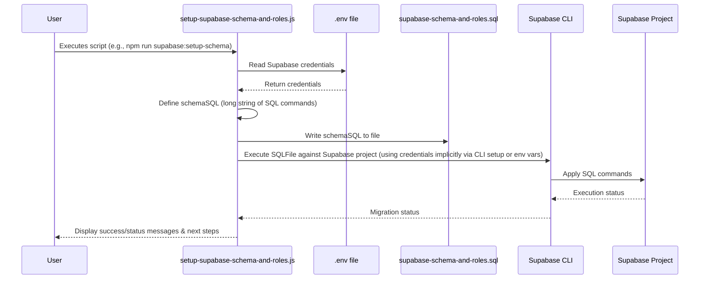

# Chapter 3: Supabase Resource Provisioning

Welcome to Chapter 3! In the [previous chapter on Appwrite Resource Provisioning](02_appwrite_resource_provisioning_.md), we saw how our "digital office builder" automated the setup of our primary Appwrite backend. Now, what if we need a specialized workshop next to our main office, equipped for specific tasks? That's where Supabase comes in, and this chapter is all about **Supabase Resource Provisioning**.

## Your Project's Specialized Backend Workshop

Sometimes, your main backend (like Appwrite in our project) handles most things, but you need extra capabilities. Maybe you need:
*   **Vast Storage:** A large warehouse for tons of images or files beyond what your main office can comfortably hold.
*   **Different Database Tools:** A workshop with specialized machinery, like a relational database with advanced query features or specific security rules (like Supabase's Row Level Security).
*   **Dedicated Logging:** A secure archive room just for activity logs.

In `comet-scanner-template-wizard`, Supabase is often used as this **secondary or complementary backend**. It works alongside Appwrite, providing these specialized services. For example, Appwrite might handle user authentication and core data, while Supabase offers extended storage for gallery images or a PostgreSQL database for complex content relationships.

**Supabase Resource Provisioning** is like having another automated crew that sets up this specialized workshop. These scripts ensure that all the Supabase database tables and storage areas are ready to go.

## What Gets Built in the "Supabase Workshop"?

The provisioning scripts for Supabase focus on setting up:

1.  **Database Tables:** Just like with Appwrite, we need "filing cabinets" (tables) in Supabase. These might be for:
    *   `extended_content`: For storing articles, blog posts, or detailed textual content.
    *   `images`: To keep records of images stored in Supabase Storage, perhaps with more detailed metadata.
    *   `logs`: For application or user activity logging.
    *   `templates`: For user-creatable templates or structures.
2.  **Row Level Security (RLS) and Roles:** Supabase offers powerful security where you can define precisely who can see or change what data, down to individual rows in a table. Scripts can set up these rules (policies) and user roles (like 'owner', 'admin', 'user').
3.  **Storage Buckets:** Secure "rooms" or containers for files, similar to Appwrite's buckets. You might have Supabase buckets for:
    *   `banner`: For website banners.
    *   `gallery`: For user-uploaded gallery images.
    *   `scanner`: For images directly from the COMET scanner device.

Automating this setup means your "Supabase workshop" is always configured correctly and consistently.

## How Does the Supabase "Workshop Crew" Operate?

Our project includes scripts like `scripts/setup-supabase-schema-and-roles.js` that handle this. Here's the general flow for a script that sets up your Supabase database schema:

1.  **Get Access to Supabase:** The script first checks your `.env` file (as discussed in [Chapter 1: Environment Configuration Automation](01_environment_configuration_automation_.md)) for your Supabase project URL (`VITE_SUPABASE_URL`) and a special `SUPABASE_SERVICE_ROLE_KEY`. This key grants the script admin-level permissions to make changes to your Supabase project.
2.  **Prepare the Blueprints (SQL):** The script contains predefined SQL (Structured Query Language) commands. SQL is the language databases understand. These commands describe:
    *   How to create tables (`CREATE TABLE`).
    *   What columns (fields) each table should have (e.g., `title TEXT`, `created_at TIMESTAMPTZ`).
    *   How to set up security rules (`CREATE POLICY`).
3.  **Execute the Blueprints:** The script uses the Supabase Command Line Interface (CLI) – a tool for interacting with Supabase from your terminal – to send these SQL commands to your Supabase project. The CLI then tells your Supabase database to create everything as defined.

Other scripts might use the Supabase CLI to create storage buckets directly.

## Running the Provisioning Scripts: Building the Workshop

To get your Supabase database schema and roles set up, you'd typically run a command in your project's terminal. For example:

```bash
npm run supabase:setup-schema
```
*(This command would be configured in your project's `package.json` file to execute a script like `scripts/setup-supabase-schema-and-roles.js`)*

**Before you run this:**
*   Make sure you have a Supabase project created.
*   Ensure your `.env` file (see [Chapter 1: Environment Configuration Automation](01_environment_configuration_automation_.md)) has the correct `VITE_SUPABASE_URL` and `SUPABASE_SERVICE_ROLE_KEY` for your project.
*   You'll also need the Supabase CLI installed (our scripts might help with this or guide you).

**What happens when you run it (e.g., `scripts/setup-supabase-schema-and-roles.js`)?**
You'll see output in your terminal, something like this (simplified):
```
SQL migration file written: /path/to/your/project/scripts/supabase-schema-and-roles.sql

Running migration...
Applying migration supabase-schema-and-roles.sql...
Migration supabase-schema-and-roles.sql applied successfully.

✅ Supabase schema and RLS setup complete!

Next steps:
1. Create storage buckets (banner, gallery, scanner) in Supabase Dashboard > Storage.
2. Set storage bucket policies...
3. To assign a user as owner/admin, insert into user_roles table...
```
Notice that this particular script might focus on the database schema and roles, and then guide you on setting up storage buckets, possibly through the Supabase dashboard or by running another script.

## A Peek Under the Hood: `scripts/setup-supabase-schema-and-roles.js`

Let's simplify how a script like `scripts/setup-supabase-schema-and-roles.js` works internally to set up your database structure.

**The Process (Non-Code Steps):**

1.  **Script Starts:** You run the command (e.g., `npm run supabase:setup-schema`).
2.  **Load Credentials:** The script reads your Supabase URL and Service Role Key from the `.env` file.
3.  **Define SQL Schema:** The script has a long string of SQL commands. This SQL defines:
    *   Tables like `user_roles`, `extended_content`, `images`, `logs`, `templates`.
    *   Functions like `get_user_role()`.
    *   Enabling Row Level Security (RLS) on tables.
    *   Creating specific security policies for who can do what (e.g., "Owner/Admin full access," "All users can read").
4.  **Write SQL to a File:** The script writes this big SQL string into a temporary file (e.g., `supabase-schema-and-roles.sql`).
5.  **Execute SQL via CLI:** It then uses a command like `npx supabase db execute --file supabase-schema-and-roles.sql` to tell the Supabase CLI to run all the SQL commands in that file against your connected Supabase project.
6.  **Feedback:** The script prints messages about its progress and any next steps (like creating storage buckets, which might be done via another script or manually for more control).

**Visualizing the Interaction:**



**Simplified Code Glimpses from `scripts/setup-supabase-schema-and-roles.js`:**

1.  **Loading Configuration and Defining SQL:**
    The script first needs the Supabase URL and Service Role Key. It also defines the SQL.
    ```javascript
    // Simplified from scripts/setup-supabase-schema-and-roles.js
    const fs = require('fs');
    const path = require('path');
    require('dotenv').config(); // Load .env variables

    const SUPABASE_URL = process.env.VITE_SUPABASE_URL;
    const SERVICE_ROLE_KEY = process.env.SUPABASE_SERVICE_ROLE_KEY;

    // A very small part of the actual schema SQL
    const schemaSql = `
    -- EXTENDED CONTENT TABLE
    CREATE TABLE IF NOT EXISTS public.extended_content (
      id uuid PRIMARY KEY DEFAULT gen_random_uuid(),
      title text NOT NULL,
      content text
      -- ... many more columns and other tables are defined in the full script
    );
    `;
    // ... (rest of the script) ...
    ```
    This snippet shows loading environment variables and a tiny fraction of the SQL commands. The actual `schemaSql` in the script is much longer, defining multiple tables, roles, and security policies.

2.  **Writing SQL to a File and Executing:**
    The script then writes this SQL to a file and uses the Supabase CLI to run it.
    ```javascript
    // Simplified from scripts/setup-supabase-schema-and-roles.js
    const { execSync } = require('child_process'); // For running shell commands

    const sqlFile = path.join(__dirname, 'supabase-schema-and-roles.sql');
    fs.writeFileSync(sqlFile, schemaSql); // Save the SQL to a file
    console.log('SQL migration file written:', sqlFile);

    try {
      // Run the SQL migration using Supabase CLI
      console.log('Running migration...');
      // The CLI uses Supabase project context (often set by 'supabase link' or env vars)
      execSync(`npx supabase db execute --file ${sqlFile}`, { stdio: 'inherit' });
      console.log('Supabase schema and RLS setup complete!');
    } catch (err) {
      console.error('Error running migration:', err);
    }
    ```
    Here, `fs.writeFileSync` saves the SQL. Then, `execSync` runs the `npx supabase db execute` command. This command tells the Supabase CLI to connect to your project (it knows which one from a previous `supabase link` command or environment variables) and apply the SQL from the specified file.

**What about Storage Buckets?**
While `setup-supabase-schema-and-roles.js` focuses on the database, other scripts like `simple-supabase-setup.js` or `auto-supabase-setup.js` might handle creating storage buckets using Supabase CLI commands:
```bash
# Example CLI command to create a public bucket named 'gallery'
npx supabase storage create-bucket gallery --public
```
Or, as `setup-supabase-schema-and-roles.js` suggests, you might be guided to create them initially via the Supabase dashboard for fine-grained control.

## Why Automate Supabase Setup?

*   **Consistency is Key:** Ensures every developer and every deployment environment has the exact same Supabase table structures, roles, and policies.
*   **Saves Time:** Manually typing SQL or clicking through a dashboard to create many tables and policies is slow. Scripts do it in seconds.
*   **Fewer Mistakes:** Reduces the chance of typos or forgetting a step when setting things up manually.
*   **Infrastructure as Code:** Your Supabase schema (the SQL script) can be version-controlled with Git, just like your application code.
*   **Perfect for Hybrid Setups:** When using Supabase alongside another service like Appwrite, automation ensures both parts of your backend are correctly provisioned and ready to work together.

## Key Takeaways

*   **Supabase as a Specialized Workshop:** In this project, Supabase often acts as a secondary backend for tasks like extended storage or advanced database features (e.g., PostgreSQL with RLS).
*   **Supabase Resource Provisioning:** Automates the creation of Supabase database tables, roles, security policies (RLS), and storage buckets.
*   **Scripts Use SQL and CLI:** Scripts like `scripts/setup-supabase-schema-and-roles.js` define the database structure using SQL and apply it via the Supabase CLI.
*   **Credentials from `.env`:** These scripts require your Supabase project URL and Service Role Key from the `.env` file (configured via steps in [Chapter 1: Environment Configuration Automation](01_environment_configuration_automation_.md)).
*   **Automation Benefits:** Provides consistency, saves time, reduces errors, and allows your backend schema to be version-controlled.

## Conclusion

You've now learned how `comet-scanner-template-wizard` can automate the setup of your Supabase resources, creating a specialized "workshop" that complements your main Appwrite backend. This ensures all necessary database tables, security rules, and storage are correctly configured.

With our environment configured (Chapter 1) and our primary (Appwrite, Chapter 2) and secondary (Supabase, this chapter) backends provisioned, we're almost ready to start coding! Next, we'll look at how to get everything running on your local computer in [Chapter 4: Local Development Environment Setup](04_local_development_environment_setup_.md).

---

Generated by [AI Codebase Knowledge Builder](https://github.com/The-Pocket/Tutorial-Codebase-Knowledge)