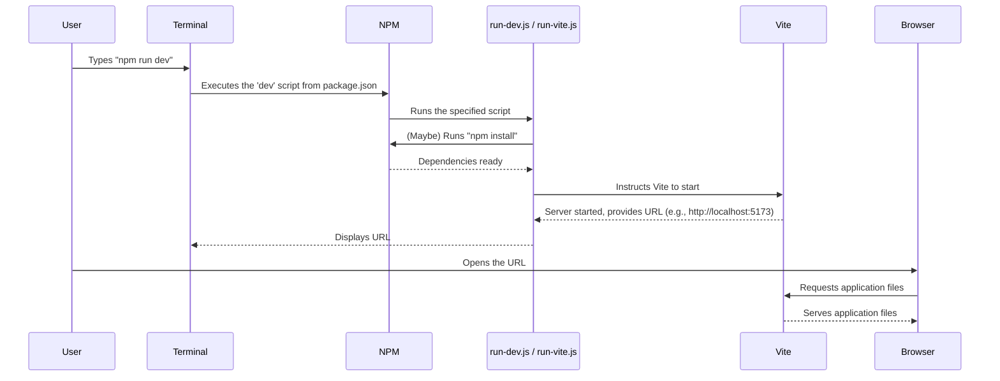

# Chapter 4: Local Development Environment Setup

Welcome to Chapter 4! In the [previous chapter on Supabase Resource Provisioning](03_supabase_resource_provisioning_.md), we learned how to automate the setup of our specialized "Supabase workshop," getting its database tables and storage ready. We've also seen how to set up our primary Appwrite backend (in [Chapter 2: Appwrite Resource Provisioning](02_appwrite_resource_provisioning_.md)) and manage our application's secrets (in [Chapter 1: Environment Configuration Automation](01_environment_configuration_automation_.md)).

Our backend services are provisioned, and our application knows how to connect to them. Now, it's time to ask: where do we actually *build* and *see* our application? This chapter focuses on setting up your **Local Development Environment** – your personal workshop where the coding magic happens!

## Your Personal Coding Workshop: The Local Development Server

Imagine you're building a beautiful custom car (our COMET Scanner app). You wouldn't build it directly on the public road! You'd want a private workshop where you can:
*   Assemble parts (write code).
*   Test the engine (run the app).
*   See your changes immediately (like a quick paint job).
*   Make mistakes without anyone else seeing until it's ready.

A **Local Development Environment** is exactly this: a setup on your own computer that lets you build, test, and view your application privately. The heart of this environment for modern web apps like ours is a **local development server**.

For `comet-scanner-template-wizard`, we use a fantastic tool called **Vite** (pronounced "veet," like "sweet") to power this local server.

**Why Vite?**
*   **Lightning Fast:** Vite is known for its incredible speed. When you start your development server or make a change to your code, Vite updates your view in the browser almost instantly.
*   **Live Reloading:** Change your code, save the file, and Vite automatically refreshes the application in your browser. No manual refreshing needed! This makes development super efficient.
*   **Easy to Use:** Vite is designed to be developer-friendly with sensible defaults.

The scripts in our project help ensure that Vite and all its necessary companions (called **dependencies**) are correctly installed and ready to run on your machine.

## Firing Up Your Workshop: Running the Dev Server

So, how do you open the doors to your personal coding workshop? In most JavaScript projects, including this one, you'll use `npm` (Node Package Manager) commands, which are shortcuts defined in a file called `package.json`.

The most common command to start your local development server is:

```bash
npm run dev
```

**What happens when you run this command?**

1.  `npm` looks into the `package.json` file to see what the `dev` script is supposed to do.
2.  Often, this script will first ensure all necessary tools and libraries (dependencies) are downloaded and installed in a folder called `node_modules`. This is like making sure all your workshop tools are on their benches. A command like `npm install` might run automatically.
3.  Then, it kicks off Vite.
4.  Vite starts building your application and launches a mini web server on your computer.
5.  You'll see messages in your terminal, typically ending with something like:

    ```
    VITE v5.x.x  ready in XXX ms

    ➜  Local:   http://localhost:5173/
    ➜  Network: use --host to expose
    ➜  press h + enter to show help
    ```

**What to do next?**
Open your web browser (like Chrome, Firefox, or Edge) and go to the "Local" address shown in your terminal (e.g., `http://localhost:5173/`).

Voila! You should see your `comet-scanner-template-wizard` application running. Now, try making a small change in one of the application's code files (e.g., in the `src/` directory). Save the file. You'll see the application in your browser update automatically to reflect your change. This is live reloading in action!

This setup is your "personal workshop" where you can build efficiently.

## Under the Hood: How Do `npm run dev` and Vite Work Together?

Let's peek behind the curtain to see what's happening.

**The Non-Code Steps:**

1.  **You type `npm run dev`**.
2.  `npm` finds the `dev` script in `package.json`. This script might point to another script file (like `run-dev.js` or `run-vite.js`) or directly to a command like `npx vite`.
3.  The designated script starts. It might first run `npm install` to make sure all project dependencies (including Vite itself) are present in the `node_modules` folder.
4.  The script then tells Vite to start.
5.  Vite compiles your application code (HTML, CSS, JavaScript, etc.) and starts a development server.
6.  Vite serves your application files to your browser when you visit `http://localhost:xxxx`.
7.  Vite also watches your project's source files. When it detects a change, it quickly rebuilds only what's necessary and signals the browser to refresh or update.

**Visualizing the Interaction:**



**A Look at the Helper Scripts:**

Our project might have scripts like `run-dev.js` or `run-vite.js` to help manage this process. Let's look at simplified versions.

**Example: `run-dev.js` (Simplified)**

This script is a straightforward way to ensure dependencies are installed and then run Vite.

```javascript
// Simplified from run-dev.js
import { execSync } from 'child_process'; // Node.js module to run shell commands

console.log('🚀 Starting development server...');

// Log Node.js and npm versions (good for debugging)
console.log('Node version:', process.version);
// ... (npm version logging) ...

// Install dependencies
console.log('\n📦 Installing dependencies...');
execSync('npm install', { stdio: 'inherit' }); // Runs 'npm install'

// Run the development server using npx
console.log('\n🔨 Starting development server...');
execSync('npx vite', { stdio: 'inherit' }); // Runs 'npx vite'
```
*   `import { execSync } from 'child_process';`: This line imports a tool from Node.js that lets us run other programs or commands from our script.
*   `execSync('npm install', { stdio: 'inherit' });`: This tells your computer to run the `npm install` command. `stdio: 'inherit'` means you'll see the output of `npm install` directly in your terminal. This ensures all project tools are downloaded.
*   `execSync('npx vite', { stdio: 'inherit' });`: This runs Vite. `npx` is a tool that runs packages like Vite, downloading them if necessary or using a version installed in your project.

**Example: `run-vite.js` (Simplified)**

This script is similar but might include more checks, like trying to find a Vite version installed directly within your project's `node_modules` before falling back to `npx`.

```javascript
// Simplified from run-vite.js
import { execSync } from 'child_process';
import { existsSync } from 'fs'; // Node.js module to check if files/folders exist
import { join } from 'path'; // Node.js module to work with file paths

// Get the current directory
const __dirname = process.cwd(); // Finds where your project is

// Check if node_modules exists
const nodeModulesPath = join(__dirname, 'node_modules');

// Install dependencies if node_modules doesn't exist
if (!existsSync(nodeModulesPath)) {
  console.log('\n📦 Installing dependencies...');
  execSync('npm install', { stdio: 'inherit' });
}

// Try to run Vite from local node_modules, or use npx
const vitePath = join(__dirname, 'node_modules', '.bin', 'vite');
if (existsSync(vitePath)) {
  console.log('Using local Vite executable:', vitePath);
  execSync(vitePath, { stdio: 'inherit' }); // Run local Vite
} else {
  console.log('Using npx to run Vite');
  execSync('npx vite', { stdio: 'inherit' }); // Fallback to npx
}
```
*   `existsSync(nodeModulesPath)`: Checks if the `node_modules` folder (where dependencies live) exists.
*   `if (!existsSync(nodeModulesPath)) { ... }`: If `node_modules` is missing, it runs `npm install`.
*   `vitePath`: Tries to locate the Vite command directly inside your project's `node_modules/.bin/` directory.
*   If found, it runs that specific `vite` command; otherwise, it uses `npx vite`.

These scripts act as convenient wrappers, ensuring your development environment starts smoothly. They make sure Vite is ready and then launch it, giving you that live-reloading server to see your code changes in real-time.

## Why is this Local Setup So Cool?

*   **Instant Feedback:** See your changes as you make them. This speeds up development and debugging massively.
*   **Safe Sandbox:** Experiment freely without affecting any live version of your application or other developers.
*   **Offline Work (Mostly):** Once dependencies are installed, you can often code and see your frontend changes even without an internet connection (though you'll need it for backend interactions).
*   **Developer-Friendly:** Tools like Vite are designed to make your life easier with features like helpful error messages.

## Key Takeaways

*   Your **Local Development Environment** is your personal workshop for building the application on your computer.
*   **Vite** is the tool that powers our fast, live-reloading local development server.
*   You typically start the server with `npm run dev`.
*   This command, often via helper scripts like `run-dev.js` or `run-vite.js`, ensures **dependencies are installed** (e.g., by running `npm install`) and then **starts Vite**.
*   Vite serves your app on a local URL (like `http://localhost:5173/`) and automatically refreshes your browser when you save code changes.

## Conclusion

You've now learned how to set up and run your local development environment using Vite! This is where you'll spend most of your time coding and bringing the COMET Scanner application to life. You have your "personal workshop" set up and ready to go.

Now that we know how to build and test our application locally, what happens when we're ready to share it with the world? In the next chapter, we'll explore the [Deployment Pipeline & Build Automation](05_deployment_pipeline___build_automation_.md), which covers how to prepare your application for a live audience.

---

Generated by [AI Codebase Knowledge Builder](https://github.com/The-Pocket/Tutorial-Codebase-Knowledge)