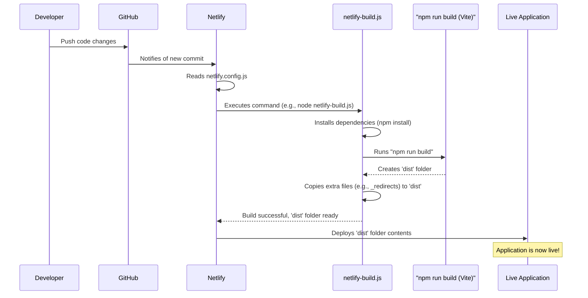

# Chapter 5: Deployment Pipeline & Build Automation

Welcome to Chapter 5! In [Chapter 4: Local Development Environment Setup](04_local_development_environment_setup_.md), we learned how to get our application running on our own computer using Vite, creating a "personal coding workshop." This is fantastic for building and testing features. But what happens when we're ready to share our amazing COMET Scanner application with the world? We need to put it online!

That's where the **Deployment Pipeline & Build Automation** comes in. This chapter will explain how we take our application from our computer and launch it live on the internet, focusing on a popular service called Netlify.

## From Your Workshop to the World: The "Automated Factory Floor"

Imagine your application's source code (the HTML, CSS, and JavaScript you write) is like raw materials. To turn these raw materials into a finished product that users can access online, we need a process. Manually doing this every time you make a change would be slow and error-prone.

**Deployment Pipeline & Build Automation** is like an automated factory floor for your application. This "factory":
1.  Takes your **source code** (raw materials).
2.  **Builds** it into an optimized, runnable application (assembles the product).
3.  **Checks** if everything looks okay (quality control).
4.  **Ships** it to the "store" (Netlify), making it available to users.

And the best part? Most of this is automated!

In `comet-scanner-template-wizard`, this "factory floor" is primarily configured to work with **Netlify**, a platform that makes it easy to host websites and web applications.

## Key Parts of Our Automated Factory

Our project has a few key components that make up this automated system:

1.  **Netlify Configuration (`netlify.config.js`):** This file is like the main instruction manual for Netlify. It tells Netlify things like:
    *   What command to run to build your application.
    *   Which folder contains the finished application files.
    *   Special rules for how files should be served (like custom headers or redirects).

2.  **Build Command (`npm run build` in `package.json`):** This is the core "assembly line" instruction. In our project, this command typically uses Vite (which we met in [Chapter 4: Local Development Environment Setup](04_local_development_environment_setup_.md)) to:
    *   Bundle all your JavaScript code into smaller, efficient files.
    *   Optimize your CSS and images.
    *   Create a `dist` folder containing all these ready-to-deploy files.

3.  **Custom Build Script (`netlify-build.js`):** Sometimes, the standard `npm run build` isn't enough. We might need extra steps, like:
    *   Ensuring specific versions of tools (like Node.js) are used.
    *   Performing a "clean install" of dependencies.
    *   Copying extra necessary files (like `_redirects` for Netlify) into the final `dist` folder.
    This script acts like a meticulous factory manager overseeing the build process.

4.  **Deployment Readiness Check (`check-deployment.js`):** After the application is built and deployed, this script can be used to run a quick check to see if the live website is up and running correctly. It's like a final quality inspector checking the product on the store shelf.

## How It Works: A Typical Netlify Deployment

Most commonly, deploying to Netlify is triggered when you push your code changes to a service like GitHub. Here's a simplified flow:

1.  **You write code** and test it in your [Local Development Environment Setup](04_local_development_environment_setup_.md).
2.  **You push your changes** to your GitHub repository.
3.  **GitHub notifies Netlify** about the new changes.
4.  **Netlify springs into action!**
    *   It reads your `netlify.config.js` (or a `netlify.toml` file if you use that format) for instructions.
    *   It runs the specified build command. In our case, this is often our custom `netlify-build.js` script.
    *   The `netlify-build.js` script performs its tasks, including running `npm run build` (which uses Vite to compile your app into the `dist` folder).
    *   Netlify takes the contents of the `dist` folder (or whatever output directory is specified) and makes it live on the internet at your unique Netlify URL.
5.  **Your site is live!** Users can now access the new version.
6.  (Optional) You or an automated process can run `check-deployment.js` against the live URL to confirm it's working.

## A Closer Look at the "Factory" Components

Let's peek at simplified versions of these important files.

### 1. Netlify Configuration (`netlify.config.js`)

This file tells Netlify the basics of how to build and serve your site.

```javascript
// Simplified from netlify.config.js
export default {
  build: {
    // Command to run to build your site
    command: 'node netlify-build.js', // Tells Netlify to run our custom script
    // Directory that contains the built site
    outputDir: 'dist', // Vite usually puts the built files here
  },
  // ... other settings like headers or redirects
};
```
*   `build.command`: This tells Netlify which command to execute to prepare your application. Here, we're pointing it to our custom `netlify-build.js` script.
*   `build.outputDir`: This specifies the folder where the final, ready-to-deploy website files will be after the `command` finishes. Vite typically outputs to a `dist` folder.

Netlify reads this configuration to understand the core build steps.

### 2. The Main Build Instruction (`npm run build` in `package.json`)

Your `package.json` file contains a `scripts` section. The `build` script is the one Vite uses to package your application for production.

```json
// Simplified from package.json
{
  "scripts": {
    "dev": "vite", // For local development
    "build": "vite build", // For creating a production build
    // ... other scripts
  }
}
```
When `npm run build` (or `vite build`) is executed, Vite takes all your source code from the `src` folder, optimizes it, and places the resulting static files (HTML, CSS, JavaScript) into the `dist` folder.

### 3. Custom Build Script (`netlify-build.js`)

This script gives us more control over Netlify's build process. It's run by Netlify because we specified it in `netlify.config.js`.

```javascript
// Highly simplified concept from netlify-build.js
import { execSync } from 'child_process'; // To run shell commands
import fs from 'fs';

console.log('🔍 Starting custom Netlify build...');

try {
  // 1. Install dependencies (important for a clean build)
  console.log('📦 Installing dependencies...');
  execSync('npm install --no-audit --no-fund', { stdio: 'inherit' });

  // 2. Run the actual Vite build command
  console.log('🔨 Building the project with Vite...');
  execSync('npm run build', { stdio: 'inherit' }); // This runs "vite build"

  // 3. Copy necessary files to dist (e.g., Netlify's redirect rules)
  console.log('📋 Copying extra files to dist...');
  if (fs.existsSync('public/_redirects')) {
    fs.copyFileSync('public/_redirects', 'dist/_redirects');
    console.log('Copied _redirects to dist.');
  }
  // You might also create a _headers file here.

  console.log('\n✅ Custom Netlify build completed successfully!');
} catch (error) {
  console.error('\n❌ Custom Netlify build failed:', error.message);
  process.exit(1); // Tells Netlify the build failed
}
```
*   `execSync('npm install ...')`: Ensures all project dependencies are correctly installed in Netlify's build environment.
*   `execSync('npm run build')`: This is where our Vite build process (defined in `package.json`) actually runs, creating the `dist` folder.
*   `fs.copyFileSync(...)`: Copies important files like `_redirects` (which tells Netlify how to handle URL redirects) into the `dist` folder so Netlify can use them.

This script acts as an orchestrator, ensuring all necessary steps are taken before Netlify deploys the `dist` folder. It might also use scripts like `netlify-node-version.js` to tell Netlify which Node.js version to use for the build.

### 4. Deployment Readiness Check (`check-deployment.js`)

After Netlify says your site is live, you can run this script (or a similar one) to do a basic health check.

```javascript
// Simplified concept from check-deployment.js
import https from 'https'; // Node.js module for making HTTP(S) requests

// Get the URL of your live site (e.g., from an environment variable)
const liveUrl = process.env.URL || 'https://your-site-name.netlify.app/';

console.log(`Checking deployment at ${liveUrl}...`);

https.get(liveUrl, (res) => {
  console.log(`Status code: ${res.statusCode}`);
  if (res.statusCode === 200) {
    console.log('✅ Site is up and running!');
  } else {
    console.log(`❌ Site returned status code ${res.statusCode}`);
  }
}).on('error', (err) => {
  console.error(`❌ Error checking deployment: ${err.message}`);
});
```
*   `process.env.URL`: Netlify often provides the live URL in an environment variable named `URL`.
*   `https.get(...)`: This makes a request to your live site.
*   `res.statusCode === 200`: A status code of 200 usually means "OK," indicating the page loaded successfully.

This script is a simple way to get some confidence that your deployment was successful. Note that the `scripts/check-deployment.js` file in the project might offer more comprehensive local pre-deployment checks to ensure your environment is configured correctly *before* you even push to deploy.

## Visualizing the Automated Factory Floor (Netlify)

Here's how the process generally flows when you push code to GitHub for a Netlify-hosted site:



## Why is this Automation So Important?

*   **Consistency:** Every deployment is built the exact same way, reducing "it worked on my machine" problems.
*   **Speed:** Automated builds and deployments are much faster than manual processes.
*   **Reliability:** Automation reduces the chance of human error during deployment.
*   **Focus:** Developers can focus on writing code, not on the repetitive tasks of deploying.
*   **Continuous Delivery:** Makes it easy to release new features and fixes frequently and confidently.

## Key Takeaways

*   **Deployment Pipeline & Build Automation** is like an "automated factory floor" that prepares and launches your application online.
*   For this project, we primarily focus on deploying to **Netlify**.
*   **`netlify.config.js`** (or `netlify.toml`) tells Netlify how to build your site.
*   The **`npm run build`** command (using Vite) compiles your app into a `dist` folder.
*   A custom script like **`netlify-build.js`** can give more control over the build steps on Netlify (installing dependencies, copying files).
*   Scripts like **`check-deployment.js`** can verify if the deployment was successful.
*   This automation makes deployments faster, more reliable, and consistent.

## Conclusion

You've now learned about the "factory floor" – the deployment pipeline and build automation processes that take your `comet-scanner-template-wizard` application from your local machine to a live website on Netlify. This automation is key to efficiently and reliably sharing your work with the world.

Netlify not only hosts our static site but can also run backend code using serverless functions. In the next chapter, we'll explore this powerful feature: [Netlify Serverless Functions](06_netlify_serverless_functions_.md).

---

Generated by [AI Codebase Knowledge Builder](https://github.com/The-Pocket/Tutorial-Codebase-Knowledge)