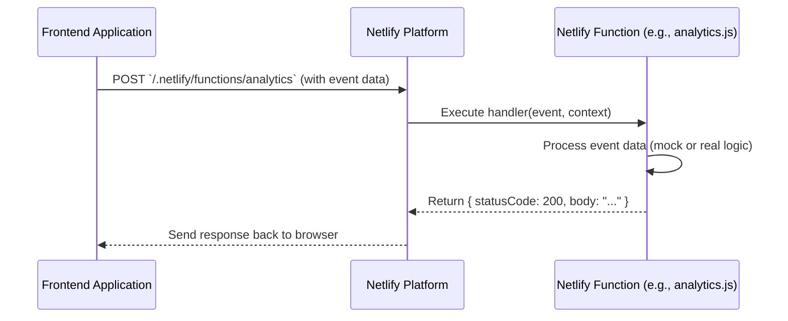

# Chapter 6: Netlify Serverless Functions

Welcome to the final chapter of our `comet-scanner-template-wizard` tutorial! In [Chapter 5: Deployment Pipeline & Build Automation](05_deployment_pipeline___build_automation_.md), we saw how our application gets built and launched online using Netlify. This is great for serving our website files (HTML, CSS, JavaScript) to users. But what if our website needs to do something a bit more complex, something that requires a little backend power? That's where Netlify Serverless Functions come in!

## Your Website's Helpful Backend Assistants

Imagine your COMET Scanner web application is like a storefront. The storefront itself (your HTML, CSS, JavaScript) can display products and interact with customers. But sometimes, it needs help from "back-office" assistants for specific tasks. For example:

*   **Securely Processing an Order:** You wouldn't want payment details handled directly in the storefront visible to everyone.
*   **Logging an Important Event:** Maybe you want to track how many times a specific button is clicked, but you want to store this information securely.
*   **Handling User Logout:** This might involve invalidating a session on a server.

Traditionally, you'd need to set up and manage your own backend server for these tasks. This can be a lot of work!

**Netlify Serverless Functions** are like small, specialized cloud-based assistants that your main application (the storefront) can call upon to perform these specific tasks. They run on Netlify's platform, so you don't have to worry about managing servers.

The `comet-scanner-template-wizard` project includes example files for these functions. While they are mostly "mock" handlers (meaning they pretend to do the work), they perfectly show the pattern you'd use to build real backend logic.

Let's say we want to track an analytics event whenever a user visits a specific page on our COMET Scanner website. Our frontend code can call a Netlify Function to record this event.

## What Exactly Are "Serverless Functions"?

The term "serverless" can be a bit misleading. It doesn't mean there are no servers involved! It means *you*, the developer, don't have to manage them. Netlify takes care of all the server infrastructure, scaling, and maintenance.

You just write small pieces of code (usually JavaScript or TypeScript) that perform a specific task.
*   These code files live in a designated folder in your project (by default, `netlify/functions/`).
*   When you deploy your site, Netlify automatically finds these files, sets them up, and makes them accessible via a special URL.
*   They only run when they're called, and you typically only pay for the time they're actually running (Netlify has a generous free tier).

## Using a Netlify Function: The "Analytics Tracker" Example

Let's imagine we want to create our "analytics tracker" assistant.

1.  **Create the Assistant (The Function Code):**
    We'd create a file, say `analytics.js`, inside the `netlify/functions/` directory.

    ```javascript
    // netlify/functions/analytics.js
    export const handler = async (event) => {
      // Get data sent from the frontend (if any)
      const body = JSON.parse(event.body || '{}');
      const eventName = body.event || 'unknown_event';

      console.log(`Analytics: Received event - ${eventName}`);

      // In a real function, you'd send this to an analytics service
      // For this mock, we just return a success message
      return {
        statusCode: 200, // Means "OK"
        body: JSON.stringify({
          message: `Analytics event '${eventName}' tracked successfully!`,
        }),
      };
    };
    ```
    *   `export const handler = async (event) => { ... }`: This is the main structure. Netlify will run this `handler` function when the function is called. The `event` object contains information about the incoming request (like data sent from the frontend).
    *   `const body = JSON.parse(event.body || '{}');`: If the frontend sends data (like with a POST request), it will be in `event.body` as a string. We parse it into a JavaScript object.
    *   `return { statusCode: 200, body: ... }`: The function must return an object like this. `statusCode` is the HTTP status (200 means success). `body` is the response data sent back to the frontend (must be a string).

2.  **Calling the Assistant from Your Frontend:**
    Your frontend JavaScript code (running in the user's browser) would use the `fetch` API to "call" this assistant. Netlify makes your function available at a URL like `/.netlify/functions/analytics`.

    ```javascript
    // In your frontend JavaScript code (e.g., in a Svelte component)
    async function trackPageView(pageName) {
      try {
        const response = await fetch('/.netlify/functions/analytics', {
          method: 'POST',
          body: JSON.stringify({ event: `viewed_${pageName}` }),
          headers: { 'Content-Type': 'application/json' },
        });
        const result = await response.json();
        console.log('Analytics response:', result.message);
      } catch (error) {
        console.error('Error tracking analytics:', error);
      }
    }

    // Example usage:
    trackPageView('comet_scanner_details');
    ```
    *   `fetch('/.netlify/functions/analytics', ...)`: This sends a request to our Netlify Function.
    *   `method: 'POST'`: We're sending data, so we use POST.
    *   `body: JSON.stringify(...)`: We send the event name as JSON data.
    *   The frontend then receives the `message` back from the function.

**Input:** The frontend sends `{ "event": "viewed_comet_scanner_details" }`.
**Output (from the Netlify Function to the frontend):** `{ "message": "Analytics event 'viewed_comet_scanner_details' tracked successfully!" }`.
**What happens on the server (in the function's logs):** You'd see "Analytics: Received event - viewed_comet_scanner_details".

This simple example shows how you can add backend logic to your static site!

## The Mock Handlers in `comet-scanner-template-wizard`

The `comet-scanner-template-wizard` project provides several files in the `netlify/functions/` directory, such as:
*   `netlify/functions/analytics.js` (like our example above)
*   `netlify/functions/process-image.js`
*   `netlify/functions/auth0-logout.js`
*   `netlify/functions/api.js` (a more general purpose API endpoint)

These are mostly **mock handlers**. This means they are set up to receive requests and send back success messages, but they don't perform complex operations like actually processing an image or integrating with Auth0 for logout.

They serve as excellent starting points and illustrate the pattern:
*   How to define a handler.
*   How to access incoming data (from `event.body` for POST requests or `event.queryStringParameters` for GET requests with URL parameters).
*   How to return a properly formatted response.

For example, here's a simplified version of `netlify/functions/process-image.js`:

```javascript
// netlify/functions/process-image.js
export const handler = async (event) => {
  const body = JSON.parse(event.body || '{}');
  const imageId = body.imageId || 'unknown';

  // In a real app, this would trigger image processing logic
  // (e.g., resizing, applying filters)
  console.log(`Request to process image: ${imageId}`);

  return {
    statusCode: 200,
    body: JSON.stringify({
      message: 'Image processing request received',
      imageId: imageId,
      status: 'pending' // Mock status
    }),
  };
};
```
This mock function just acknowledges the request. To make it real, you'd add code to interact with an image processing library or service.

## How Does It Work Under the Hood?

Let's visualize what happens when your frontend calls a Netlify Function:

1.  **Request from Frontend:** Your application's JavaScript (running in the user's browser) makes an HTTP request to a special Netlify path, like `/.netlify/functions/analytics`.
2.  **Netlify Receives Request:** Netlify's infrastructure routes this request.
3.  **Function Invocation:** Netlify finds the corresponding JavaScript file (e.g., `netlify/functions/analytics.js` that you deployed with your site as part of the process in [Chapter 5: Deployment Pipeline & Build Automation](05_deployment_pipeline___build_automation_.md)). It then executes the `handler` function within that file.
4.  **Function Executes:** Your function code runs. It can perform calculations, make requests to other services (like databases or third-party APIs), etc.
5.  **Response from Function:** Your handler returns a response object (with `statusCode` and `body`).
6.  **Netlify Sends Response:** Netlify takes this response and sends it back to your frontend application.

Here's a simplified sequence diagram:



Netlify handles all the complexities of finding your code, running it in a secure environment, and scaling it if many users call it at once.

## Benefits of Netlify Serverless Functions

*   **Simplicity:** No servers for you to manage, patch, or scale. Just write your function code.
*   **Cost-Effective:** You typically pay only for the execution time your functions use, and Netlify has a generous free tier.
*   **Scalability:** Functions scale automatically to handle load.
*   **Integrated with Your Frontend:** They work seamlessly with sites hosted on Netlify.
*   **Add Backend Power to Static Sites:** You can build more dynamic and powerful applications without a traditional monolithic backend.
*   **Secure:** Great for tasks that involve secret keys or sensitive operations, as this logic isn't exposed in the frontend code.

## Key Takeaways

*   **Netlify Serverless Functions** are like small, on-demand backend assistants for your website.
*   They let you run server-side code without managing servers.
*   You write JavaScript (or TypeScript) `handler` functions in the `netlify/functions/` directory.
*   Your frontend calls these functions using standard HTTP requests to URLs like `/.netlify/functions/your-function-name`.
*   The provided examples in `comet-scanner-template-wizard` are mostly **mock handlers** that show the pattern for building real backend logic.
*   Netlify automatically deploys and manages these functions when you deploy your site (as covered in [Chapter 5: Deployment Pipeline & Build Automation](05_deployment_pipeline___build_automation_.md)).

## Conclusion

Congratulations! You've reached the end of the `comet-scanner-template-wizard` tutorial. You've learned about automating your environment configuration, provisioning backend resources with Appwrite and Supabase, setting up your local development environment, automating your deployment pipeline, and now, leveraging Netlify Serverless Functions to add backend capabilities to your projects.

With Netlify Serverless Functions, you can extend your frontend applications with powerful server-side logic, enabling features like data processing, secure API interactions, and custom workflows, all without the headache of traditional server management. The mock handlers in this project give you a solid foundation to build out these features for your own amazing applications.

We hope this tutorial has equipped you with the knowledge to make the most of the `comet-scanner-template-wizard` and accelerate your web development journey! Happy coding!

---

Generated by [AI Codebase Knowledge Builder](https://github.com/The-Pocket/Tutorial-Codebase-Knowledge)