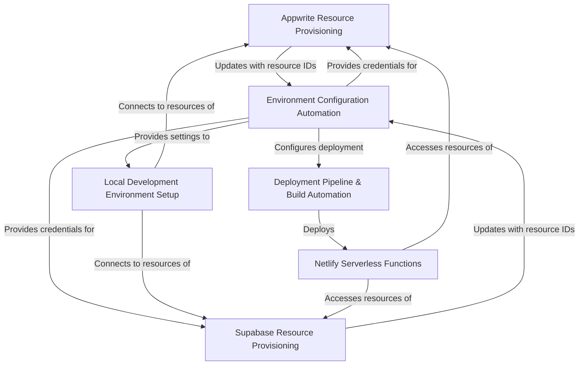

# Tutorial: comet-scanner-template-wizard

This project, `comet-scanner-template-wizard`, is a **tooling system** designed to *streamline the setup* of a new web application. It automates the **provisioning of backend resources** for services like *Appwrite* (for primary backend features) and *Supabase* (for complementary data storage or database functionalities). Additionally, it handles **environment configuration**, establishes a **local development setup** using Vite, and automates **deployment pipelines** (e.g., to Netlify), including the setup for **Netlify serverless functions**. The main goal is to provide developers with a quick start for building full-stack applications by automating many initial configuration steps.

**Source Repository:** [https://github.com/chasinalts/comet-scanner-template-wizard.git](https://github.com/chasinalts/comet-scanner-template-wizard.git)

## Chapters

1. [Environment Configuration Automation
](01_environment_configuration_automation_.md)
2. [Appwrite Resource Provisioning
](02_appwrite_resource_provisioning_.md)
3. [Supabase Resource Provisioning
](03_supabase_resource_provisioning_.md)
4. [Local Development Environment Setup
](04_local_development_environment_setup_.md)
5. [Deployment Pipeline & Build Automation
](05_deployment_pipeline___build_automation_.md)
6. [Netlify Serverless Functions
](06_netlify_serverless_functions_.md)

---

Generated by [AI Codebase Knowledge Builder](https://github.com/The-Pocket/Tutorial-Codebase-Knowledge)